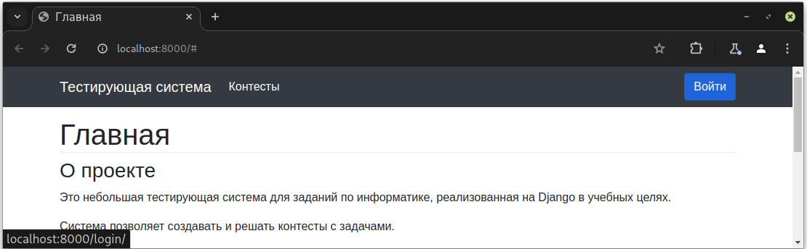

# Тестирующая система для задач по информатике.
#### (учебный проект для курса по практике программирования на Python.)

Поддерживает Linux и Windows (разрабатывался на Linux).

## Оглавление
-[Установка](#установка)

-[Использование](#использование)

-[Разработка](#разработка)

## Установка
Проект использует [poetry](https://python-poetry.org/) для управления зависимостями.
#### 1. Установка poetry.
* Poetry рекомендует использовать pipx или скрипт установщик.
[Официальная инструкция по установке poetry](https://python-poetry.org/docs/)

* Для Linux можно попробовать использовать версию из репозитория, но нужна как минимум >= 1.3.
    * debian-based (debian, ubuntu, etc.):
    ```console
    $ sudo apt install python3-poetry
    ```
    * arch-based (arch, manjaro, garuda, etc.):
    ```console
    $ sudo pacman -S python-poetry
    ```
* Windows (10+, проверено на 11)
Открыть *PowerShell* И выполнить:
```powershell
$ Set-ExecutionPolicy -ExecutionPolicy RemoteSigned -Scope CurrentUser
$ Invoke-RestMethod -Uri https://get.scoop.sh | Invoke-Expression
$ scoop install pipx
$ scoop install python
$ scoop bucket add versions
$ scoop install python312 # poetry не умеет сама устанавливать версии питона
$ pipx ensurepath
```
Закрыть *PowerShell*, Открыть *PowerShell* снова (чтобы применились настройки путей).
```powershell
$ pipx install poetry
```

#### 2. Клонирование проекта.
Может потребоваться [установить git](https://git-scm.com/book/en/v2/Getting-Started-Installing-Git).
* Для Linux нужно установить пакет *git* из репозитория дистрибутива.
* Для Windows можно использовать *scoop*, как для установки pipx:
    ```powershell
    $ scoop install git
    ```
```console
$ git clone https://github.com/ErrrOrrr503/djando-edu
$ cd django-edu
```

#### 3. Установка среды poetry.
```console
$ poetry install --only main
```
`--only main` устанавливает только зависимости для запуска, но не для разработки.

Если возникает ошибка `The currently activated Python version <> is not supported by the project...` То нужно установить версию питона 3.12.

* Для Windows мы это уже сделали выше, чтобы она заработала:
    ```powershell
    $ poetry env use python312
    ```
* Для Linux - установить нужную версию и также сделать
    ```console
    $ poetry env use python<version>
    ```
    Подробнее в [документации poetry](https://python-poetry.org/docs/managing-environments/).

#### 4. Запуск сервера.
```console
$ poetry run python manage.py runserver
```
После этого сервер запустится на локальной машине на порту 8000.

## Использование

В браузере перейти на страницу [http://localhost:8000](http://localhost:8000)


#### Строка навигации
Из строки навигации можно вернуться на главную, кликнув по "Тестирующая система", перейти к списку контестов и на страницу входа.

#### Страница входа
Для добавления контестов и задач требуется войти от имени учителя:
```
Логин: teacher
Пароль: contests
```
Логин и пароль передаются через POST открытым текстом. Для аутентификации используется встроенный в Django механизм работы с пользователями.

За успешным входом следует переадресация на страницу, на которой была нажата кнопка "Войти".

#### Список контестов
На странице списка контестов можно просматривать, удалять и добавлять контесты. Имя добавляемого контеста должно быть не пустым и уникальным.

При удалении контеста, все входящие в него задачи, а также тесты к этим задачам тоже удаляются.

#### Задачи
При переходе в контест открывается список задач в нем.

Поддерживаются задачи двух типов:

* С ответом в виде текста. При создании задачи добавляется эталонный ответ. Предлагаемые ответы сверяются с эталоном. Пробельные символы в начале и в конце не учитываются.
* С ответом в виде кода на python. Для такой задачи предложенный код прогоняется на добавленных учителем тестах.

Добавление задачи:

* Сначала необходимо выбрать тип создаваемой задачи.
* Название должно быть не пусто и не должно сожержать html.
* Текст условия должен быть не пуст и может содержать html (чтобы можно было красиво оформить условие), но не должен содержать script.
* Эталонный ответ должен быть не пост и не должен содержать html.
* Тесты добавляются на странице созданной задачи. Тест представляет из себя пару <ввод, ожидаемый вывод>. Пробельные символы в начале и в конце вывода удаляются. Ввод может быть пусым, вывод не может.


## Разработка
Для разработки и необходимо установить все зависимости:
```console
$ poetry install
```
#### Проверки
Проект типизирован при помощи *mypy*.

*Flake8* и *pylint* сконфигурированы в setup.cfg:
1) разрешена длина строки до 90 символов.
2)  Исключен автогенерированный код в папке migrations.
3) Для *pylint* включен *pylint_django* модуль.

* Проверка типов *mypy*:
    ```console
    $ poetry run mypy --strict .
    Success: no issues found in 17 source files
    ```
* Линтер *pylint*:
    ```console
    $ poetry run pylint django_edu
    ...
    Your code has been rated at 9.68/10 (previous run: 9.68/10, +0.00)
    ```
* Проверка соответствия PEP8 *flake8*:
    ```console
    $ poetry run flake8 .
    <Пустой вывод - ошибок нет>
    ```

#### Структура проекта.
Используется архитектура Model-View-Presenter c репозиторием.

📁 django_edu — исполняемый код

- 📁 locale — локализация (перевод) приложения
    - 📁 ru/LC_MESSAGES
        - 📄 django.mo - скомпилированный перевод
        - 📄 django.po - файл перевода

- 📁 migrations — автогенерированный код для миграции моделей в БД
- 📄 \_\_init\_\_.py - пустой файл, необходим для работоспособности import
- 📄 asgi.py — django asgi настройки
- 📄 checher.py - проверка ответов к задачам и прогон тестов
- 📄 models.py - модели: контест, задача, тест
- 📄 settings.py - конфигурация проекта
- 📄 urls.py - связь между url и функциями, генерирующими ответ на запрос
- 📄 view.py - функции, генерирующие веб страницы на основе шаблонов
- 📄 wsgi.py - django wsgi настройки

📁 static — статические ресурсы, в данном случае только css

📁 templates — шаблоны веб страниц
- 📄 base_page.html - остов всех остальных страниц
- 📄 contests.html - список контестов
- 📄 index.html - главная страницы
- 📄 login.html - страница входа
- 📄 tasks.html - страница просмотра, добавления, удаления задач
- 📄 tests.html - страница добавления, удаления тестов к задаче

📄 db.sqlite3 - файл базы данных проекта
📄 manage.py - скрипт-менеджер django проекта
📄 pyproject.toml - файл с описанием зависимостей для poetry
📄 setup.cfg - файл конфигурации pylint и flake8


#### Работа с переводом
Перевод выполнен при встроенного в django gettext.

Сгенерировать новый шаблон:
```console
$ poetry run django-admin makemessages -l ru
```

После этого можно выполнить перевод в `django_edu/locale/ru/LC_MESSAGES/django.po`

Скомпилировать перевод:
```console
$ poetry run django-admin compilemessages
```

Выставить желаемый язык в настройках сервера `settings.py`:
```python
LANGUAGE_CODE = 'ru'
```

